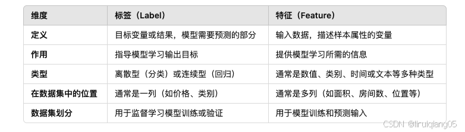
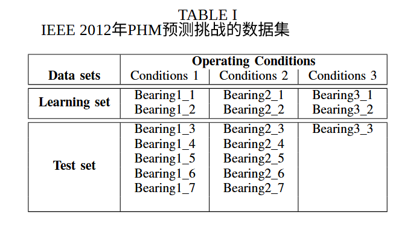
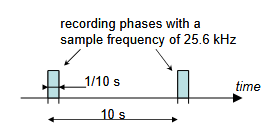
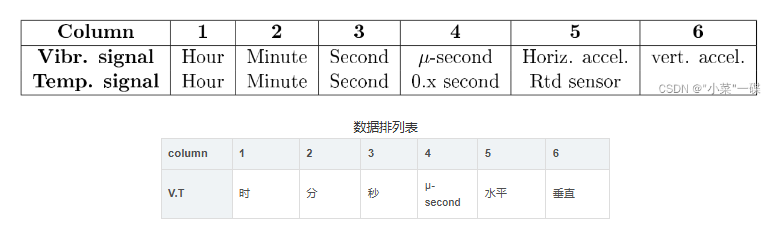
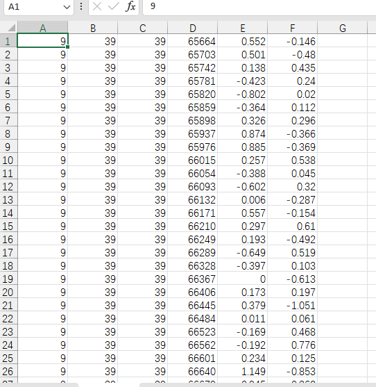
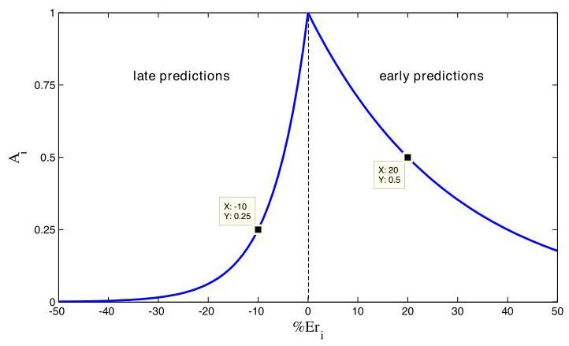

+++
title = '滚动轴承数据集学习'
date = 2026-03-17T16:36:33+08:00
categories = ["深度学习", "数据集"]
math = true
image = 'img/评分函数的图.jpg'
+++

## 先搞清楚数据集的特征和标签是什么？

特征是输入，标签是输出

## 什么是特征工程？

特征工程就是在有限的特征的情况下，怎么样在有限的特征中找出更多更好的特征。

是将原始数据转化为**更能代表预测模型潜在物理规律**的过程。

## 经典的滚动轴承寿命预测数据集学习

本次毕设是用CNN提取特征，直接输入原始数据即可，但是要正则化避免过拟合

参考文献：PRONOSTIA: An experimental platform for bearings accelerated degradation tests.

这个文献介绍了数据集采集的环境和内容

**关于挑战,RUL被定义为加速度计超过20g的时间。**

关于 PHM 挑战,考虑了三种不同的负载:  

- 第一种工况: 1800rpm 和 4000 N ; 
- 第二种工况:1650 转/分钟和 4200 N;  
- 第三种操作条件: 1500rpm 和 5000 N

### 数据采集特性

​	学习和测试数据集都在7z压缩文件夹中提供。每个都包含名为**acc_xxxxx.csv的振动**ASCII 文件和名为**temp_xxxxx.csv的温度**ASCII文件。

振动信号(水平和垂直)  轴承的上下左右振动

- 采样频率: 25.6kHz 
- 记录:每10秒记录2560个样本(即 1/10 s )

#### 温度之于寿命预测影响太小

看数据发现没有温度的CSV文件，于是疑惑

​	在基于深度学习的滚动轴承剩余寿命预测领域，**只用振动信号（不用温度）不仅是“可以的”，而且是“绝对的主流”。**

- **振动信号是“先行指标”**：当轴承刚刚出现肉眼甚至看不见的微小剥落或裂纹时，每一次滚珠滚过裂纹，就会产生一次微弱的“冲击”。这种冲击会立刻反映在振动加速度（acc）信号中。所以 CNN 能够敏锐地捕捉到这种**早期的退化特征**。
- **温度信号是“滞后指标”**：轴承因为微小裂纹产生故障后，很长一段时间内温度都不会发生明显变化。只有当轴承损坏到非常严重的地步，导致机械摩擦急剧增加时，温度才会突然飙升。当你发现温度升高时，轴承往往在几分钟或几十分钟内就要彻底报废了。依靠温度根本做不到**提前预测剩余寿命（RUL）**。

#### 数据采集参数

如下所示
	振动信号（水平和垂直）-采样频率：25.6 kHz-记录：每10秒记录2560个样本（即1/10 s）（见图6）-温度信号-采样频率（10 Hz）-记录：IEEE PHM 2012数据挑战每分钟记录600个样本

以bearing_1_1为例的csv详细数据如下：

##### 以第一行数据为例：0.552，-0.146(水平，竖直)代表什么意思

根据数据集描述文档，加速度计型号 DYTRAN 3035B 

- 50 g 测量范围  - 100mV/g

**水平：0.552**  

> 代表在这个瞬间，轴承在水平方向上受到了 0.552g 的加速度（相当于它承受了一半的自身重量的侧向推力）。

**竖直：-0.146**  

> 代表在这个瞬间，轴承在竖直方向上受到了 0.146g 的加速度。**这里的负号（-）仅仅代表“方向”**。假设传感器规定“向上震动”为正，那么“-0.146”就表示这一瞬间轴承正在向**下**震动。

### 准确度定义，验证模型好坏

​	团队的得分基于其RUL结果,这些结果已转换为预测的百分比误差。分别记 $\overline{RUL_i}$ 和 $ActRUL_i$ 为参与者估算的轴承剩余使用寿命, $ActRUL_i$ 为实际待预测的(actual) RUL(其中 $i \in [1,11]$ 代表表1中定义的测试轴承)。实验 $i$ 的百分比误差定义为: 

$$
\% Er_i = 100 \times \frac{ActRUL_i - \widehat{RUL_i}}{ActRUL_i} \tag{1}
$$
​	\( \ {\% E{r}_{i} > 0} \) ：实际时间大于预估——高估了轴承

​	\( \ {\% E{r}_{i} > 0} \) ：实际时间小于预估——低估了轴承

​	低估和高估的情况**不应该以相同方式考虑**：早期RUL预测相关的良好估算表现 (即 \( \left. {\% E{r}_{i} > 0}\right) \) ,**考虑提前拆除**的情况，以及对超出实际组件RUL的RUL估算，应该给予更严重的扣除(即 \(\left. {\% E{r}_{i} < 0}\right)\) 。因此,实验 \(i\) 的RUL估算**准确度**得分定义如下。函数图展示了该评分函数的演变过程。

​	说人话就是：**高估轴承寿命的代价，远比低估的代价要惨痛得多**

$$
{A}_{i} = \left\{  \begin{array}{ll} {ex}{p}^{-\ln \left( {0.5}\right) .\left( {E{r}_{i}/5}\right) } & \text{ if }E{r}_{i} \leq  0 \\  {ex}{p}^{+\ln \left( {0.5}\right) .\left( {E{r}_{i}/{20}}\right) } & \text{ if }E{r}_{i} > 0 \end{array}\right. \tag{2}
$$
即
$$
A_i = \begin{cases} 0.5^{-Er_i / 5} & \text{当 } Er_i \le 0 \text{ （高估寿命，机器炸机）} \\ 0.5^{Er_i / 20} & \text{当 } Er_i > 0 \text{ （低估寿命，提前拆除）} \end{cases}
$$
官方通过把**分母**分别设定为 5 和 20，强制画出了两条下降速度完全不同的曲线：

- **高估的悬崖**：向左走（高估），分母是 5，分数掉得极快，是个陡峭的悬崖。
- **低估的缓坡**：向右走（低估），分母是 20，分数掉得慢，是个平缓的下坡。

所有 RUL 估计的最终得分被定义为所有实验得分的平均值:		
\[
\text{ Score } = \frac{1}{11}\mathop{\sum }\limits_{{i = 1}}^{{11}}\left( {A}_{i}\right) \tag{3}
\]

### 需估算的实际剩余使用寿命(RUL)

<table><tr><td>Test set</td><td>Actual RUL</td></tr><tr><td>Bearing1_3</td><td>5730 s</td></tr><tr><td>Bearing1_4</td><td>339 s</td></tr><tr><td>Bearing1_5</td><td>1610 s</td></tr><tr><td>Bearing1_6</td><td>1460 s</td></tr><tr><td>Bearing1_7</td><td>7570 s</td></tr><tr><td>Bearing2_3</td><td>7530 s</td></tr><tr><td>Bearing2_4</td><td>1390 s</td></tr><tr><td>Bearing2_5</td><td>3090 s</td></tr><tr><td>Bearing2_6</td><td>1290 s</td></tr><tr><td>Bearing2_7</td><td>580 s</td></tr><tr><td>Bearing3_3</td><td>820 s</td></tr></table>

## 参考资料

[IEEE PHM 2012 Prognostic challenge Outline, Experiments, Scoring of results, Winners](https://zhuanlan.zhihu.com/p/583606882)

[PRONOSTIA : An experimental platform for bearings accelerated degradation tests.](https://blog.csdn.net/qq_46698539/article/details/133618414?ops_request_misc=elastic_search_misc&request_id=1a42fcb9a074ae9088bcd8c696562fec&biz_id=0&utm_medium=distribute.pc_search_result.none-task-blog-2~all~top_click~default-2-133618414-null-null.142^v102^pc_search_result_base3&utm_term=PHM2012&spm=1018.2226.3001.4187)